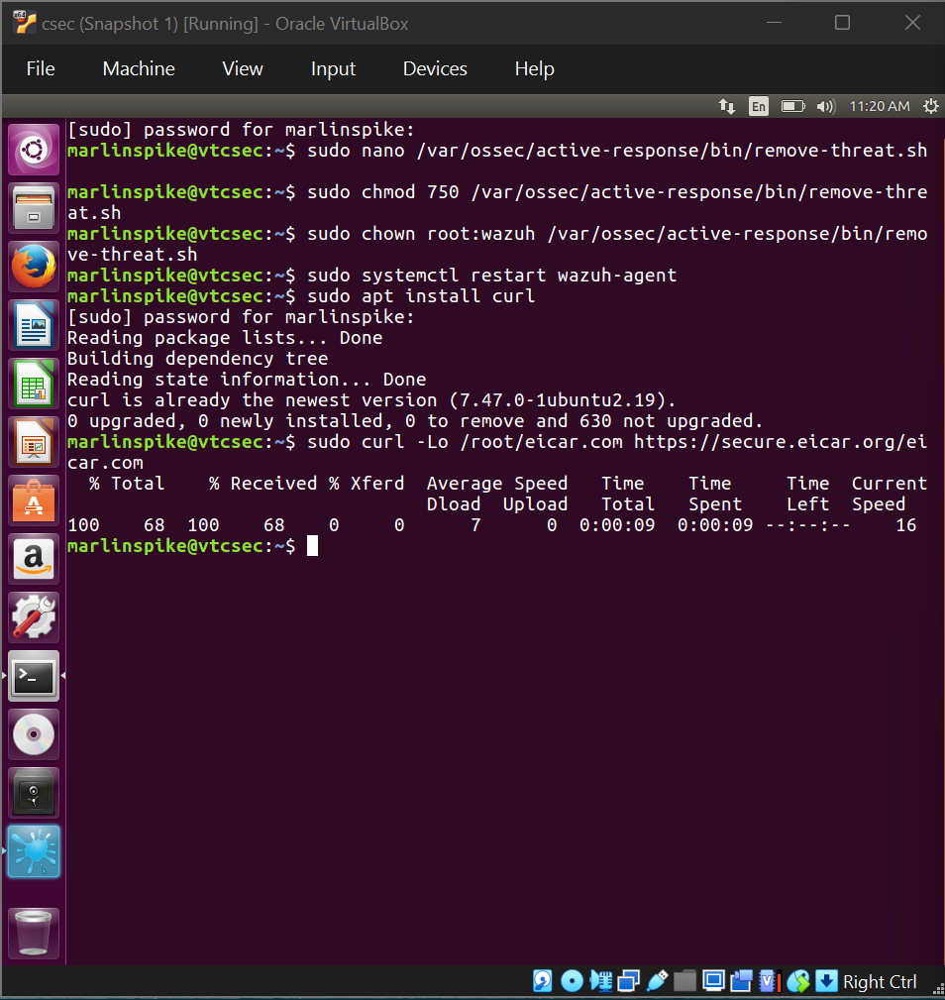
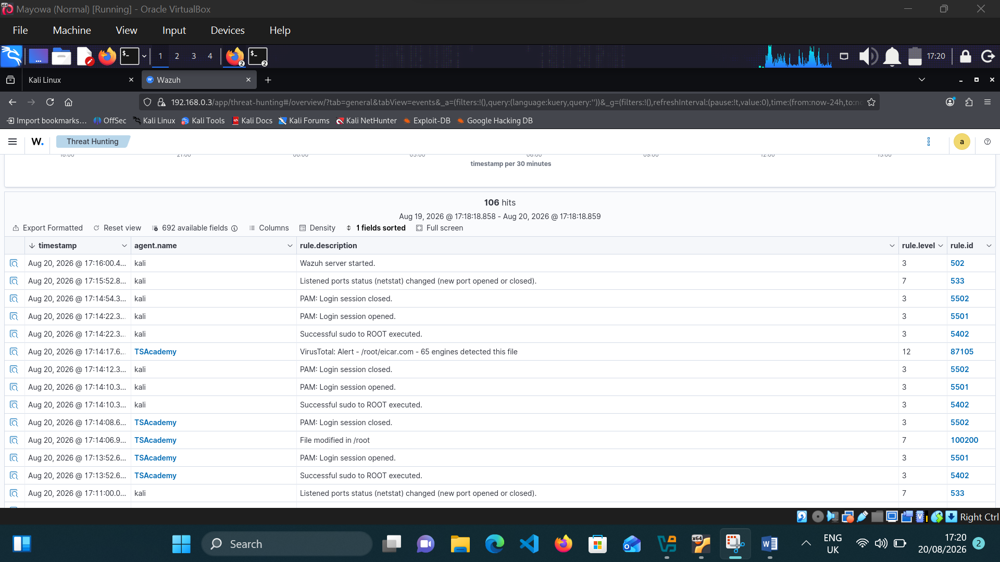
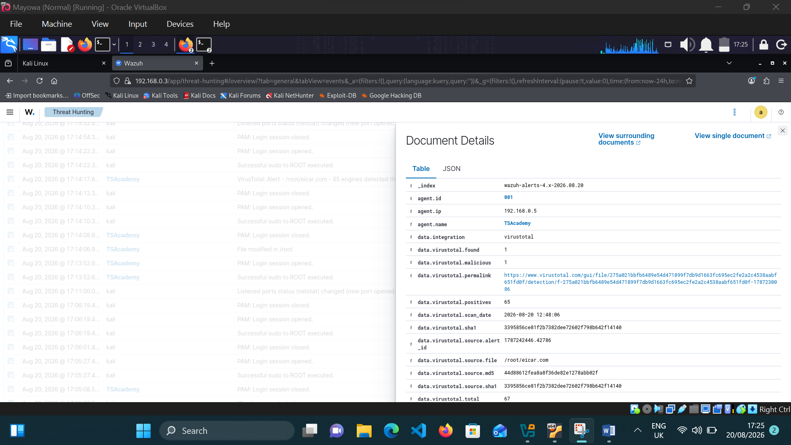
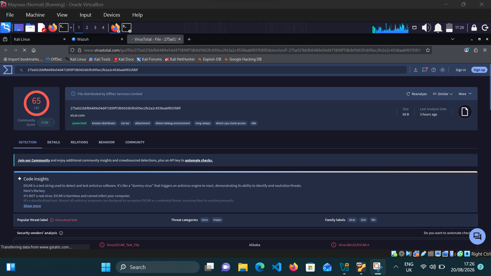
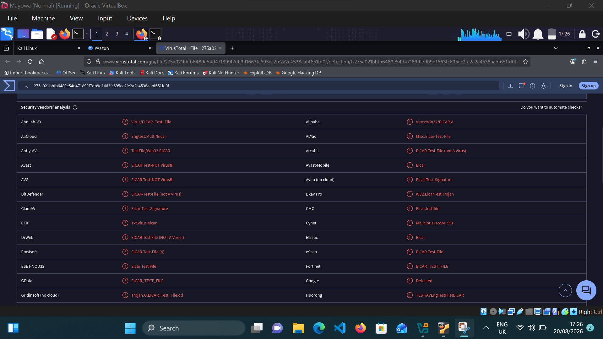
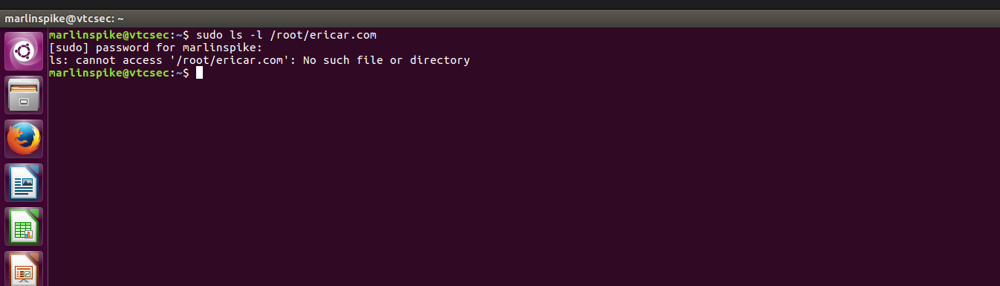

# Automated Threat Detection and Response with Wazuh & VirusTotal

## Overview

This project demonstrates an automated threat detection and response workflow using **Wazuh, the VirusTotal API, and Wazuh Active Response**.


An EICAR test file was downloaded onto an Ubuntu endpoint running the Wazuh Agent. Wazuh File Integrity Monitoring (FIM) detected the file activity and forwarded the event to the Wazuh Manager running on Kali Linux. The file hash was analyzed through the VirusTotal API for threat intelligence enrichment, after which Wazuh Active Response automatically removed the detected file.

### Lab Safety Notice:
This project uses automated file detection triggered by an external API response. It should be tested in a controlled lab environment. Do not deploy this Active Response configuration without proper testing, safeguarding, and authorization. 


## Architecture

```
┌──────────────────────┐
│   Ubuntu Endpoint    │
│    Wazuh Agent       │
│                      │
│   EICAR Test File    │
│      Downloaded      │
└──────────┬───────────┘
           │
           │ Security Event
           ↓
┌──────────────────────┐
│     Kali Linux       │
│    Wazuh Manager     │
└──────────┬───────────┘
           │
           │ Alert + File Hash
           ↓
┌──────────────────────┐
│     VirusTotal API   │
│ Threat Intelligence  │
└──────────┬───────────┘
           │
           │ Threat Intelligence
           ↓
┌──────────────────────┐
│  Wazuh Active        │
│      Response        │
└──────────┬───────────┘
           │
           ↓
      File Removed
```

## Lab Environment

| Component           | Configuration         |
| ------------------- | --------------------- |
| Wazuh Manager       | Kali Linux            |
| Wazuh Agent         | Ubuntu                |
| SIEM                | Wazuh                 |
| Threat Intelligence | VirusTotal API        |
| Automated Response  | Wazuh Active Response |

### Wazuh Rule Flow:
|Rule ID | level | sources | Role |
|--------|-------|---------|------|
| 100200 / 100201| 7       | local_rules.xml| 
| 87105  | 12    | wazuh built-in VirusTotal ruleset.| Triggers when Virustotal reports that security vendors flagged the  file hash, providing a detection signal


## Security Test

To safely simulate a malware detection event, the **EICAR test file** was downloaded onto the Ubuntu endpoint running the Wazuh Agent (with jq already installed ['via scripts/setup-agent.sh'](scripts/setup-agent.sh))

```bash
sudo apt install curl
```

```bash
sudo curl -Lo /root/eicar.com https://secure.eicar.org/eicar.com
```


The EICAR test file is a standardized antivirus test file designed to safely validate malware detection and security monitoring controls. It is **not actual malware**.

## Detection & Investigation

### Detection

* Wazuh FIM  detected the EICAR test file activity on the **Ubuntu endpoint**.
* The Wazuh Agent forwarded the security event to the **Wazuh Manager running on Kali Linux**.
* The generated alert provided relevant information including the **file name, file path, hash, timestamp, agent name, alert level, and detection rule**.

### Detection Details

| Field | Value |
|---|---|
| File Name | `eicar.com` |
| File Path | `/root/eicar.com` |
| SHA-1 | `3395856ce81f2b7382dee72602f798b642f14140` |
| Timestamp | `17:14:17` |
| Agent  | `TSAcademy` |
| Alert Level | `12` |
| Detection Rule | `87105` |




### Threat Intelligence Enrichment

- The detected file was identified using its **SHA-1 hash**.
- The hash was submitted to the **VirusTotal API** for threat intelligence enrichment.
- VirusTotal identified the file as the EICAR test file, with 65/67 security engines detecting it.
- The Wazuh alert and VirusTotal results were correlated to validate the detection.





## Automated Response

After the detection and threat-intelligence analysis, **Wazuh Active Response automatically removed the detected file from the Ubuntu endpoint**.
The VirusTotal analysis generated rule `87105`, which triggered the configured Wazuh Active Response to remove the file.



This demonstrates how SIEM detection, threat intelligence, and endpoint response can be integrated into an automated security workflow, reducing the need for manual intervention.

### cleanup:
Ater testing, verify that the EICAR file has been removed from ubuntu endpoint.

```
sudo rm -f /root/eicar.com
```
## Conclusion:
This projects reinforced how to layer detection logic so automation only acts on confirmed threats, not raw alerts.
A distinction that matters in any SOC environment where false positive carry real costs.

## Skills Demonstrated

- Endpoint Detection 
- Threat Intelligence 
- VirusTotal API Integration
- File Hash Analysis 
- Wazuh Active Response 
- Security Automation


```
Automated-Threat-detection-Response/
│
├── README.md
│
├── Screenshots/
│   ├── 01_eicar_download.png
│   ├── 02_detection.png
│   ├── 02_detection_details.png
│   ├── 03_virustotal_dashboard.png
│   ├── 03_virustotal_details.png
│   └── 04_file_removed.png
│
├── scripts/
│   ├── setup-agent.sh
│   └── remove-threat.sh
│
└── configuration/
    ├── ubuntu-agent-ossec.conf
    ├── kali-manager-ossec.conf
    └── local_rules.xml

```